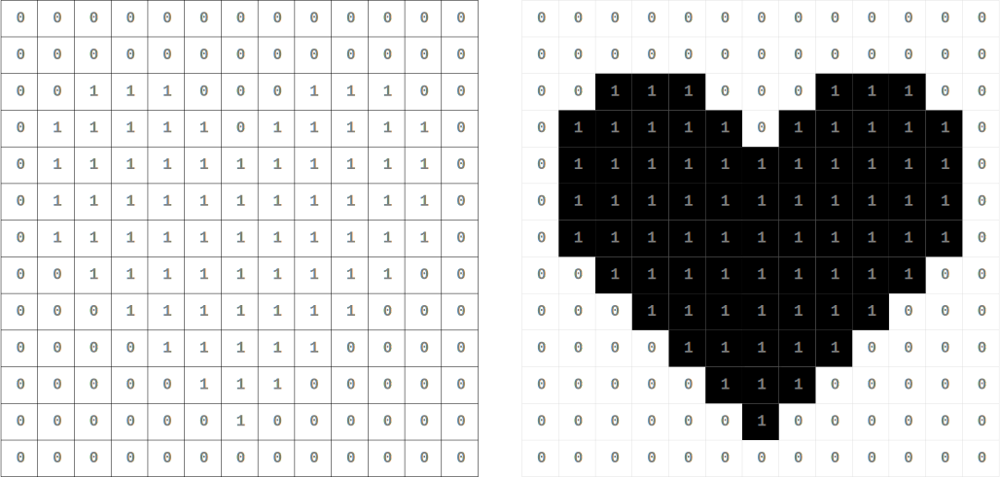

# pixel-raster
Create a pixel raster representation of an image (for educational purposes).

## Bits and pixels

A digital (pixel) image simply is a number of bits in a given format.
It encodes the size (width and height) of the image, i.e. how many
columns and rows of pixels the image consists of as well as the color
(and saturation and brightness) of each pixel.

The most easy case is a black and white image where each pixel is
represented by one bit.

## A paint yourself pixel image 

To explain how an image is represented as data it can help to show
paint-yourself raster versions (see [images.pdf](images.pdf)).

## img2pixel

The script takes images from the command line as input and
outputs `svg` or [`tikz`](https://ctan.org/pkg/pgf) code to stdout.

See `img2pixel -h`.

## xpm2tikz

If you have problems installing RMagick you may want to use an older
(crappier) version instead: [`pixel_raster_xpm`](https://github.com/Lapizistik/pixel_raster_xpm).
It can only take simple xpm images as input and produces tikz.